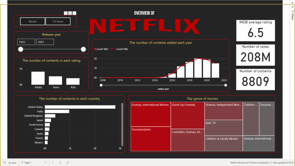
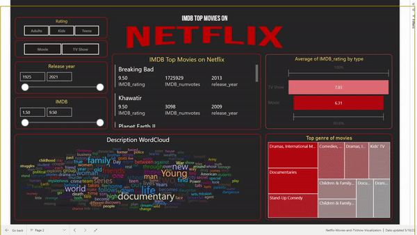

# Netflix Data Analysis Dashboard

## Project Overview
This project analyzes Netflix Movies and TV Shows data using Power BI. The goal is to uncover insights related to content distribution, genres, ratings, release trends, and country-wise availability. The dashboard helps users understand Netflix's content strategy and growth patterns through interactive visualizations.

## Objectives
- Analyze the distribution of Movies and TV Shows.
- Identify top content-producing countries.
- Explore genre popularity and content ratings.
- Study content release trends over time.
- Generate business insights using interactive dashboards.

## Tools & Technologies
- Power BI
- Power Query
- DAX
- Microsoft Excel / CSV Dataset

## Dataset
The dataset contains information about Netflix titles, including:
- Title
- Type (Movie/TV Show)
- Director
- Cast
- Country
- Date Added
- Release Year
- Rating
- Duration
- Genre

## Data Cleaning & Transformation
- Removed duplicate records
- Handled missing values
- Standardized column formats
- Created calculated columns and DAX measures

## Dashboard Features
- Total Titles KPI
- Movies vs TV Shows Analysis
- Content by Country
- Content by Genre
- Rating Distribution
- Release Year Trends
- Interactive Filters and Slicers

## Key Insights
- Movies represent the majority of Netflix content.
- Content production has increased significantly in recent years.
- Drama and Comedy are among the most popular genres.
- Mature audience ratings dominate the platform.

## Business Recommendations
- Invest more in high-performing genres.
- Expand content offerings in emerging markets.
- Use regional insights to improve content acquisition strategies.

## Dataset
we use 2 datasets
* the first one is Netflix Movies and TV Shows on [kaggle](https://www.kaggle.com/datasets/shivamb/netflix-shows) 
* the second one is IMDb score from [IMDb Datasets](https://www.imdb.com/interfaces/) (note that we use title.basics.tsv and title.ratings.tsv)
then we combine it all together using `data_preparation.ipynb` and the final preprocessed data is in `data/netflix_titles_with_IMDB.csv`

## Results
This project depicts 2 story points.
1. an overview of Netflix content \

2. Top IMDB score contents \

## Conclusion
This project demonstrates skills in data cleaning, data transformation, DAX calculations, dashboard design, and data storytelling using Power BI.

